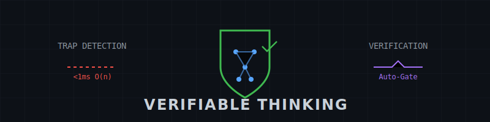

<div align="center">



**LLMs fail predictably on cognitive traps. This catches them.**

[](https://www.npmjs.com/package/verifiable-thinking-mcp)
[](https://github.com/CoderDayton/verifiable-thinking-mcp/actions/workflows/ci.yml)
[](https://codecov.io/gh/CoderDayton/verifiable-thinking-mcp)
[](https://opensource.org/licenses/MIT)

*Bat-and-ball, lily pad doubling, Monty Hall—15 trap patterns detected in <1ms, no LLM calls.*

[Quick Start](#quick-start) • [Features](#features) • [Trap Detection](#trap-detection) • [API](#tools)

</div>

---

An MCP server for structured reasoning with cognitive trap detection, verification gates, and context compression.

```
┌────────────────────────────────────────────────────────────────┐
│ "A bat and ball cost $1.10. The bat costs $1 more..."          │
│                             ↓                                  │
│ TRAP DETECTED: additive_system                                 │
│ > Don't subtract $1 from $1.10. Set up: x + (x+1) = 1.10       │
│                             ↓                                  │
│ Answer: $0.05 (not $0.10)                                      │
└────────────────────────────────────────────────────────────────┘
```

## Why This Exists

| The Problem | Our Solution |
|-------------|--------------|
| LLMs answer "$0.10" to bat-ball ~40% of the time | Trap priming catches it before reasoning starts |
| Verification requires another LLM call | O(n) heuristics, zero LLM overhead |
| Reasoning chains drift without structure | Scratchpad with confidence tracking & auto-verification |

## Quick Stats

| Metric | Value |
|--------|-------|
| 🎯 Cognitive trap patterns | 15 structural detectors |
| ⚡ Detection latency | <1ms (O(n) single-pass) |
| 🧪 Test coverage | 1831+ tests, 100% line coverage |
| 📦 Dependencies | 3 runtime (fastmcp, zod, dotenv) |

## Features

| Feature | What It Does |
|---------|--------------|
| 🎯 **Trap Detection** | 15 cognitive trap patterns (bat-ball, Monty Hall, base rate...) via O(n) heuristics |
| 📝 **Scratchpad** | Structured reasoning with step tracking, confidence, and verification gates |
| 🔢 **Local Compute** | Math expression evaluation without LLM round-trips |
| 🗜️ **CPC Compression** | Query-aware context compression for long reasoning chains |

## Quick Start

**Zero config install:**

```bash
npx -y verifiable-thinking-mcp
```

### Claude Desktop

Add to `claude_desktop_config.json`:

```json
{
  "mcpServers": {
    "verifiable-thinking": {
      "command": "npx",
      "args": ["-y", "verifiable-thinking-mcp"]
    }
  }
}
```

Or with Bun:

```json
{
  "mcpServers": {
    "verifiable-thinking": {
      "command": "bunx",
      "args": ["verifiable-thinking-mcp"]
    }
  }
}
```

### Basic Usage

```typescript
// Step 1: Start reasoning with trap priming
scratchpad({
  operation: "step",
  question: "A bat and ball cost $1.10. The bat costs $1 more than the ball. How much does the ball cost?",
  thought: "Let me set up equations. Let ball = x, bat = x + 1.00",
  confidence: 0.9
})
// Returns trap_analysis warning about additive_system pattern

// Step 2: Continue reasoning
scratchpad({
  operation: "step",
  thought: "x + (x + 1.00) = 1.10, so 2x = 0.10, x = 0.05",
  confidence: 0.95
})

// Step 3: Complete with spot-check
scratchpad({
  operation: "complete",
  final_answer: "$0.05"
})
// Auto spot-checks against stored question
```

## Tools

### `scratchpad` (primary)

Unified reasoning tool with operation-based dispatch.

**Operations:**

| Operation | Purpose | Required Params |
|-----------|---------|-----------------|
| `step` | Add reasoning step | `thought` |
| `complete` | Finalize chain | — |
| `revise` | Fix earlier step | `thought`, `target_step` |
| `branch` | Alternative path | `thought` |
| `navigate` | View history | `view` (history\|branches\|step\|path) |
| `spot_check` | Manual trap check | `question`, `answer` |
| `hint` | Progressive simplification | `expression` |
| `mistakes` | Algebraic error detection | `text` |
| `augment` | Compute math expressions | `text` |
| `override` | Force-commit failed step | `failed_step`, `reason` |

**Key Parameters:**

| Parameter | Type | Description |
|-----------|------|-------------|
| `question` | string | Pass on first step for trap priming |
| `thought` | string | Current reasoning step |
| `confidence` | 0-1 | Step confidence (accumulates to chain average) |
| `verify` | boolean | Enable domain verification (auto-enabled after step 3) |
| `domain` | enum | math, logic, code, general |
| `warn_at_tokens` | number | Soft limit: warn when session tokens exceed threshold |
| `hard_limit_tokens` | number | Hard limit: block operations when exceeded |

**Token Tracking:**

Every response includes token usage metadata:

```json
{
  "tokens": { "input_tokens": 42, "output_tokens": 156, "total_tokens": 198 },
  "session_tokens": { "total_input": 84, "total_output": 312, "total": 396, "operations": 2 }
}
```

**Cost Control:**

Use `warn_at_tokens` for soft warnings, or `hard_limit_tokens` to block operations:

```typescript
// Soft limit: warns but allows operation
scratchpad({
  operation: "step",
  thought: "...",
  warn_at_tokens: 2000  // Adds token_warning to response
})

// Hard limit: blocks operation entirely
scratchpad({
  operation: "step",
  thought: "...",
  hard_limit_tokens: 5000  // Returns status="budget_exhausted" if exceeded
})
// Response includes budget_exhausted with recommendation to complete or start new session
```

**Workflow:**

1. `step(question="...", thought="...")` → trap_analysis if patterns detected
2. Continue with `step(thought="...")` → auto-verify kicks in after step 3
3. If verification fails → `revise` or `branch`
4. `complete(final_answer="...")` → auto spot-check against stored question
5. If status="review" → follow `reconsideration.suggested_revise`

### `list_sessions`

List all active reasoning sessions.

### `get_session`

Retrieve session in `full`, `summary`, or `compressed` format.

### `clear_session`

Clear specific session or all sessions.

### `compress`

Standalone CPC-style context compression.

```typescript
compress({
  context: "Long text to compress...",
  query: "relevance query",
  target_ratio: 0.5,
  boost_reasoning: true
})
```

## Trap Detection

Detects 15 structural patterns without LLM calls:

| Pattern | Trap | Example |
|---------|------|---------|
| `additive_system` | Subtract instead of solve | bat-ball, widget-gadget |
| `nonlinear_growth` | Linear interpolation | lily pad doubling |
| `rate_pattern` | Incorrect scaling | 5 machines/5 minutes |
| `harmonic_mean` | Arithmetic mean for rates | average speed round-trip |
| `independence` | Gambler's fallacy | coin flip sequences |
| `pigeonhole` | Underestimate worst case | minimum to guarantee |
| `base_rate` | Ignore prevalence | medical test accuracy |
| `factorial_counting` | Simple division | trailing zeros in n! |
| `clock_overlap` | Assume 12 overlaps | hour/minute hand |
| `conditional_probability` | Ignore conditioning | given/if probability |
| `conjunction_fallacy` | More detail = more likely | Linda problem |
| `monty_hall` | 50/50 after reveal | door switching |
| `anchoring` | Influenced by irrelevant number | estimation after priming |
| `sunk_cost` | Consider past investment | should continue? |
| `framing_effect` | Gain/loss framing bias | save vs die |

## Architecture

```
src/
├── index.ts              # FastMCP server entry
├── tools/
│   ├── scratchpad.ts     # Main reasoning tool (1800 LOC)
│   ├── sessions.ts       # Session management
│   └── compress.ts       # Compression tool
└── lib/
    ├── think/
    │   ├── spot-check.ts # Trap detection (O(n))
    │   ├── guidance.ts   # Domain detection
    │   └── scratchpad-schema.ts
    ├── compression.ts    # CPC-style compression
    ├── compute/          # Local math evaluation
    ├── verification.ts   # Domain verifiers
    ├── session.ts        # Session manager with TTL
    └── extraction.ts     # Answer extraction
```

## Development

```bash
# Clone and install
git clone https://github.com/CoderDayton/verifiable-thinking-mcp.git
cd verifiable-thinking
bun install

# Interactive dev mode with MCP Inspector
bun run dev

# Inspect server capabilities
bun run inspect

# Run tests
bun test

# Type check
bun run typecheck

# Lint and format
bun run check
```

## Benchmarks

See `examples/benchmarks/`:

| Benchmark | Purpose |
|-----------|---------|
| `priming-latency.ts` | Validates O(n) trap detection (<1ms) |
| `priming-bench.ts` | LLM accuracy with/without priming |
| `math-bench.ts` | Local compute accuracy |
| `compression-bench.ts` | Compression ratio and retention |

Run benchmarks:

```bash
cd examples/benchmarks
bun run priming-latency.ts
bun run priming-bench.ts --full
```

## vs Sequential Thinking MCP

How does this compare to `@modelcontextprotocol/server-sequential-thinking`?

| Feature | Sequential Thinking | Verifiable Thinking |
|---------|---------------------|---------------------|
| Thought tracking | ✅ | ✅ |
| Branching | ✅ Basic | ✅ + hypothesis + success criteria |
| **Trap detection** | ❌ | ✅ 15 patterns |
| **Verification** | ❌ | ✅ 4 domains |
| **Consistency checking** | ❌ | ✅ Contradiction detection |
| **Confidence tracking** | ❌ | ✅ Per-step + chain average |
| **Adversarial challenge** | ❌ | ✅ 4 challenge types |
| **Local compute** | ❌ | ✅ Math + hints + mistake detection |
| **Context compression** | ❌ | ✅ CPC-style |
| **Token tracking** | ❌ | ✅ Per-call + budget limits |

Sequential Thinking is minimal scaffolding (~150 lines). Verifiable Thinking is a complete verification system with 18 additional features.

See [`docs/competitive-analysis.md`](docs/competitive-analysis.md) for full comparison.

## License

MIT

---

<div align="center">

**[Report Bug](https://github.com/CoderDayton/verifiable-thinking-mcp/issues) · [Request Feature](https://github.com/CoderDayton/verifiable-thinking-mcp/issues)**

Made with 🧠 for more reliable AI reasoning

</div>
